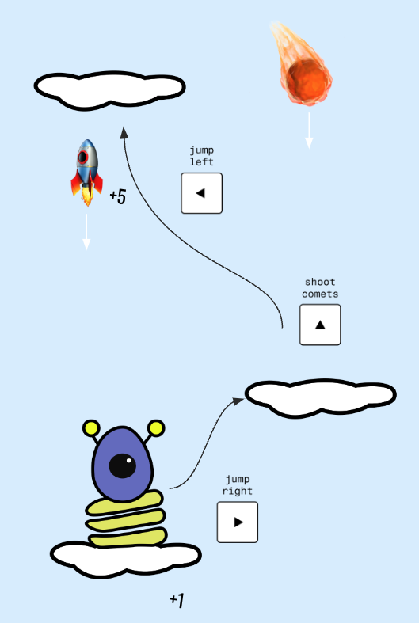

# ALIEN JUMP

Welcome to **Alien Jump**! Great to have you here!
Help the little alien get back to space by jumping on clouds, collecting rockets, and avoiding falling or getting hit by comets.

[START PLAY 🪐](https://nathidaum.github.io/alien-jump-game/)

## Description

**Alien Jump** is a fun and fast-paced game where you guide a little alien back to space by hopping on clouds. The higher the alien jumps, the more points you score. Collect rockets for bonus points, but watch out for the comets!

## Instructions

**Goal**: Jump on clouds to reach space. Each cloud that passes the bottom adds 1 point.

**Score Boost**: Collect 🚀 rockets for an additional +5 points.

**Obstacles**: Avoid ☄️ comets and don't fall below the screen, or it’s game over.

## Navigation

**Move**: Use the arrow keys to move left or right.

**Shoot**: Shoot comets using the arrow up key.

## Have fun playing!

[START PLAY 🪐](https://nathidaum.github.io/alien-jump-game/)